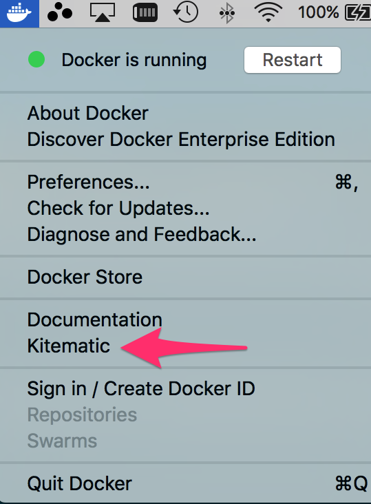

# Docker workshop

This is a simple demonstration of Docker and Docker Compose.

## Installation

You will need Docker installed.
If you did install it, you can test your installation using:

``` shell
docker version;
```

### If you are still to install

- For modern OS'es you can find the native client downloads [here](https://www.docker.com/community-edition#/download)
  - **Make sure your OS version is supported!**
- If your OS version is **not** supported by the native clients then you will need to install `docker toolbox`
  - Please finish reading this README prior to attempting to install, especially Windows/Linux users
  - Windows and Mac users first go [here](https://www.docker.com/products/docker-toolbox)
  - Continue reading while the download completes :)

### Windows Users

**This only applies to those who had to install `docker-engine`**.

`docker-engine` upon installation asks to install `git`.  You
**should** allow it to install Git if you don't already have Git
running on your machine.  This is due to a dependency that
`docker-toolbox` has on `bash.exe`.

`docker-toolbox ` will install a shortcut on your Desktop.  If you
already have Git installed, but still run into errors upon waking up
`docker-toolbox ` then you might need to follow up on
this [thread](https://github.com/docker/toolbox/issues/335).

Upon waking up Docker might ask for `Host needs VT-x/AMD-v enabled for
docker-machine to work on virtualbox`.  To fix this you will need to
tweak your BIOS settings.  You can find
instructions
[here](https://docs.fedoraproject.org/en-US/Fedora/13/html/Virtualization_Guide/sect-Virtualization-Troubleshooting-Enabling_Intel_VT_and_AMD_V_virtualization_hardware_extensions_in_BIOS.html).

As Docker wakes up it prompts for a bunch of permissions (to enable
the network and such).  Please ensure that you grant Docker all the
permissions it needs.

### Linux Users

You might need to follow the
instructions
[here](https://docs.docker.com/engine/installation/linux/linux-postinstall/),
in particular the section under "Manage Docker as a non-root user".

### Optionally

**You don't need to do this if you are using `docker-toolbox` (It's
already included).**

If you installed the Docker (Native) Client, then you can optionally
click on the Docker icon in your toolbar and install `Kitematic`.
Simply click on it, and follow the instructions.



## Test your installation

Once again,

```
docker version;
```

This will tell you if all went well.

## Warm up your engines!

**You want to do this BEFORE you show up for the workshop!!**

Running this over a slow-wifi connection might not go well

```
docker pull openjdk:8u131-jre;
docker pull mongo:3.4.5;
docker pull jenkins:2.32.3;
docker pull alpine:3.4;
docker pull jenkins:2.32.3;
```

## Finally

Please follow the instructions under "Building" in [code/hello-vertx/README.md](code/hello-vertx/README.md).

**Again, you probably don't want to do this in a environment with a slow wi-fi connection**

## License

This workshop was prepared by [Raju Gandhi](www.rajugandhi.com) and is
distributed under
the [MIT License](http://www.opensource.org/licenses/MIT).
